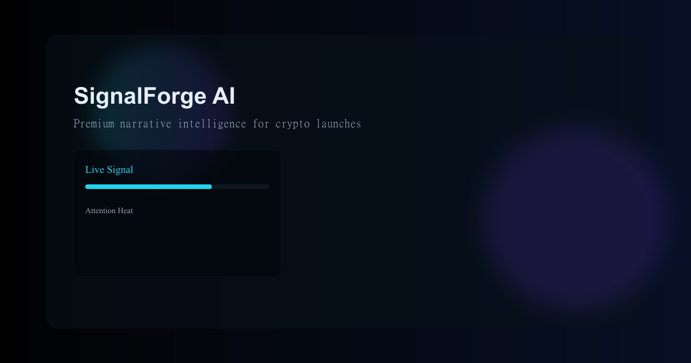

# ⚡️ SignalForge AI

SignalForge AI is a highly advanced, multi-modal crypto narrative intelligence engine. It leverages the power of Anthropic's Claude 3.5 Sonnet and an autonomous agentic loop to generate structured, actionable market intelligence. 

Unlike standard AI chatbots, SignalForge operates autonomously—pulling live market data and news *before* running its analysis, ensuring every insight is grounded in real-time reality.



## 🔥 Core Features

### 1. Multi-Persona AI Analysis
SignalForge doesn't just give generic answers; it acts as a specialized consultant with 5 distinct brain modes:
*   **📈 Trader Mode:** Focuses on short-term price action, technical setups, and immediate alpha.
*   **💼 VC Mode:** Evaluates long-term sustainability, tokenomics, and institutional adoption.
*   **🎨 Creator Mode:** Designed for audience engagement, generating viral hooks and content scripts.
*   **🐸 Meme Mode:** Analyzes pure virality, internet culture, and community hype.
*   **🔍 Research Mode:** Delivers deep, unbiased, analytical breakdowns of fundamental shifts.

### 2. Autonomous Agentic Loop
SignalForge features a true **Agentic Loop**. When you submit a prompt, the AI has the autonomy to pause, realize it needs more context, and securely search the web via integrated tools before it begins writing its final analysis. 

### 3. Live Price Tracking 
The backend natively taps into the **CoinGecko API** to fetch live, up-to-the-second prices for major assets (Bitcoin, Ethereum, Solana, Dogecoin). Claude uses this precise data to inform its short-term and long-term outlooks.

### 4. Real-Time News Aggregation
The agent is equipped to pull in live, trending news headlines, allowing it to gauge exactly what the market is reading, reacting to, and pricing in today.

### 5. Structured Intelligence Dashboards
Instead of returning a wall of text, the AI's output is formatted into a highly readable, data-driven JSON dashboard. It automatically generates:
*   **Proprietary Scores:** Ratings out of 10 for Virality, Attention, Sustainability, and Monetization.
*   **Market Psychology:** Deep behavioral analysis of the current market state.
*   **Actionable Alpha:** Direct trading setups or investment strategies.
*   **Content Angles:** Ready-to-post hooks for creators and influencers.

## 🚀 Getting Started

### Prerequisites
*   Node.js v18+
*   An Anthropic API Key (`ANTHROPIC_API_KEY`)

### Local Development

1. **Clone the repository:**
   ```bash
   git clone https://github.com/your-username/SignalForge-AI.git
   cd SignalForge-AI
   ```

2. **Setup the Backend:**
   ```bash
   cd server
   npm install
   ```
   *Create a `.env` file in the `server` directory and add your key:*
   ```env
   ANTHROPIC_API_KEY=your_api_key_here
   ```
   *Start the server:*
   ```bash
   node server.js
   ```

3. **Setup the Frontend:**
   *Open a new terminal in the root `SignalForge-AI` directory:*
   ```bash
   npm install
   npm run dev
   ```

### ☁️ Deployment (Render)
This project is pre-configured to be deployed on Render. 
1. Deploy the `server` directory as a Web Service on Render and add your `ANTHROPIC_API_KEY` to the environment variables.
2. A GitHub Actions workflow (`.github/workflows/keep-alive.yml`) is included to ping the server every 14 minutes, preventing Render's free tier from spinning down your backend due to inactivity!

---
*Built with React, Express, Vite, and Anthropic Claude.*
